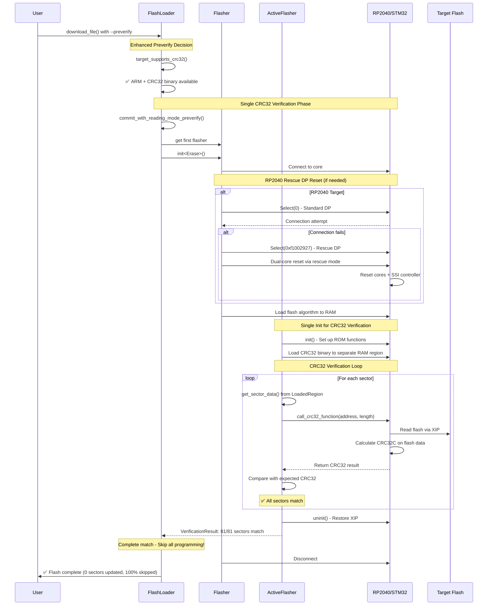
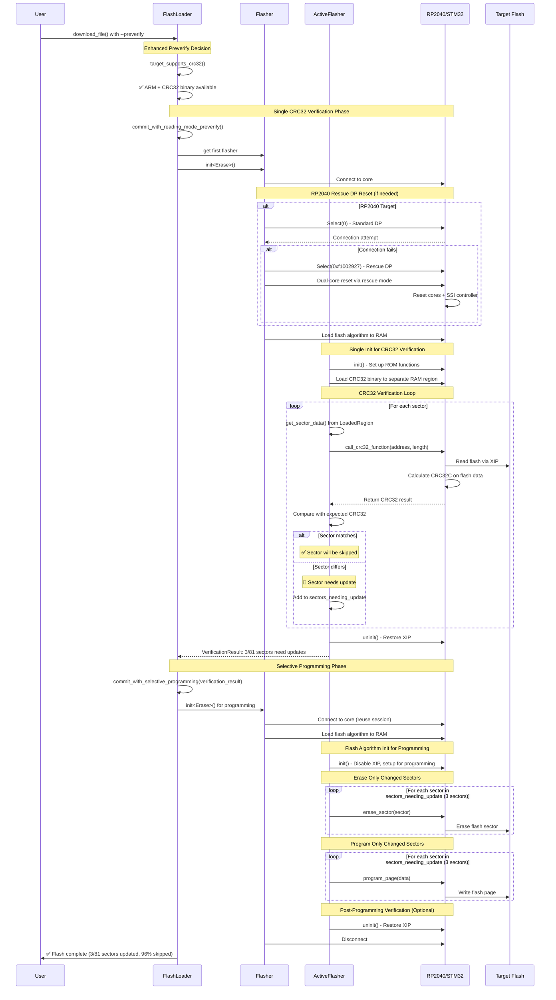
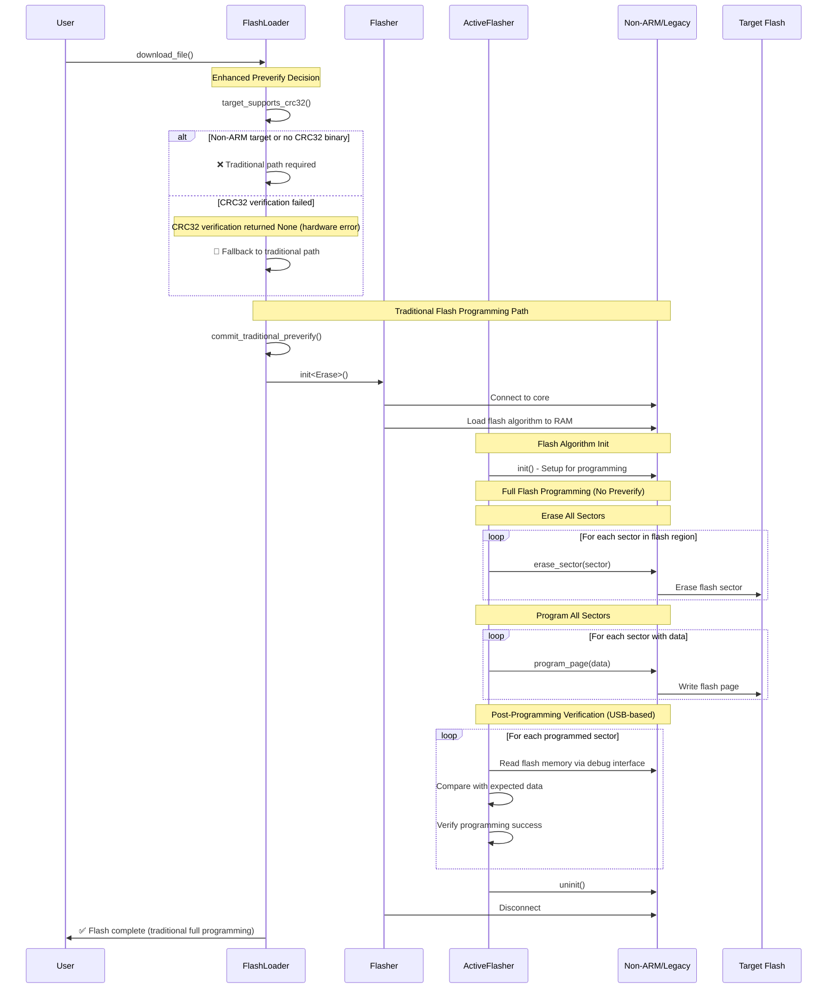
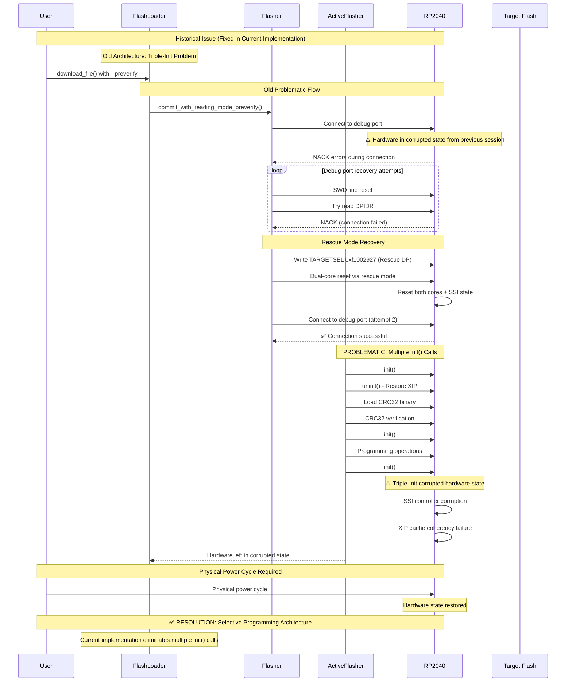
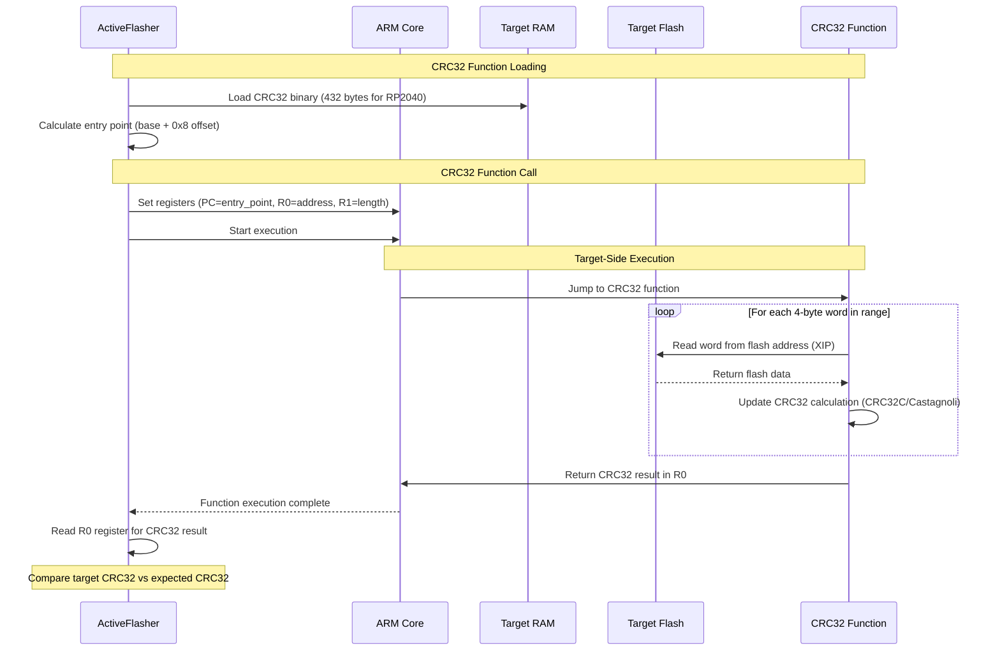

# CRC32 Incremental Flash Verification - Sequence Diagrams (Updated)

## Overview
These diagrams show the current selective programming architecture for CRC32-based incremental flash verification in probe-rs, reflecting the working implementation as of the RP2040 rescue mode compatibility fix.

## Scenario 1: Complete CRC32 Match - No Programming Required (Optimal Path)

## Scenario 2: Selective Programming - Only Changed Sectors Updated

## Scenario 3: Traditional Path (Non-CRC32 Targets or CRC32 Failure Fallback)

## Scenario 4: RP2040 Rescue Mode - Historical Corruption Issues (RESOLVED)

## Scenario 5: CRC32 Function Details (Target-Side Execution)

## Key Architecture and Performance Notes (Updated)

### Selective Programming Performance Benefits
- **Traditional Full Programming**: Erase + program all 81 sectors (~324KB)
- **Selective Programming**: Only update changed sectors (3/81 sectors, ~12KB)
- **Performance gain**: 96% reduction in flash operations
- **CRC32 Verification**: Target-side execution with XIP (~100+ MB/s vs USB ~10-50 MB/s)

### Current Architecture (Post-Fix)
1. **Single CRC32 Verification Phase**: init() → CRC32 verification → uninit() → return VerificationResult
2. **Selective Programming Phase**: init() → erase/program only changed sectors → uninit()
3. **RP2040 Rescue DP**: Proactive use of multidrop address 0xf1002927 for dual-core reset

### Resolved Issues
- **Triple-Init Problem**: Eliminated multiple flash algorithm init() calls that corrupted RP2040 hardware
- **Sector Data Extraction**: Fixed get_sector_data() to properly extract LoadedRegion pages instead of returning erased bytes
- **Progress Bars**: Restored progress reporting for --preverify operations
- **Hardware Corruption**: RP2040 rescue mode now works without leaving hardware in corrupted state

### Error Handling and Fallbacks
- CRC32 verification failure → fallback to traditional full programming
- Hardware connection issues → rescue DP reset → retry
- Non-ARM targets → traditional programming path
- Critical: Hardware power cycle only needed for legacy corruption issues (resolved)

### Memory Layout and Safety
- Flash algorithm: Loaded to RAM during init()
- CRC32 function: Separate RAM allocation to avoid stack collisions
- Entry point calculation: Base address + 0x8 offset for ARM position-independent code
- Stack management: Separate regions with safety gaps

### Verification Methods
- **CRC32C/Castagnoli**: Using embedded-crc32c crate for consistency between host and target
- **Algorithm**: Polynomial 0x1EDC6F41, hardware acceleration on supported targets
- **Binary Size**: ~432 bytes for thumbv6m-none-eabi (RP2040)